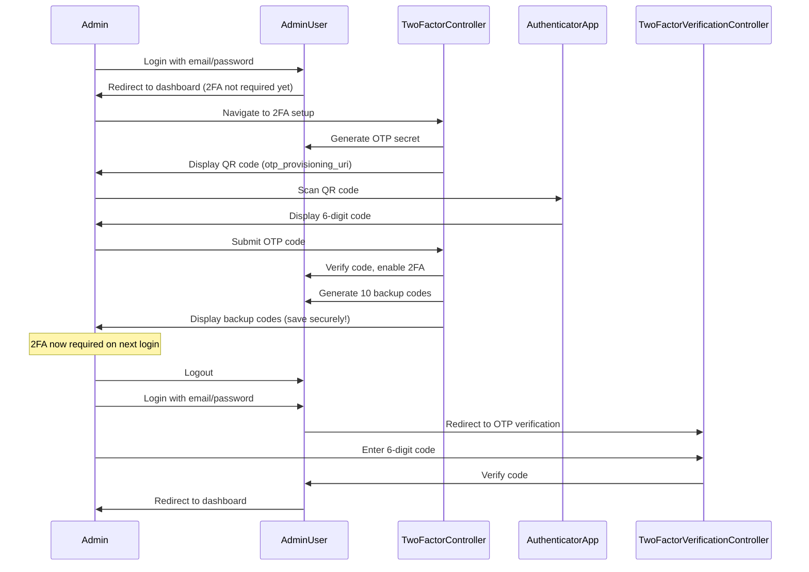
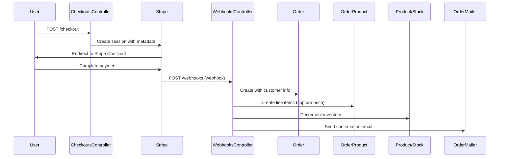
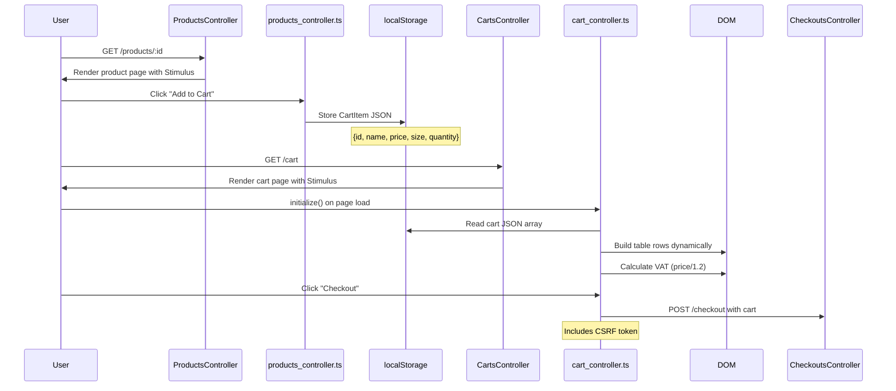

# AI Agent Instructions for E-Commerce Rails 7

> **Essential Guide**: This document provides the critical knowledge AI agents need to be immediately productive in this codebase. Read `.github/copilot-instructions.md` for comprehensive details.

## Quick Start Commands

```bash
# Development
bin/dev                   # Start Rails, Tailwind, TypeScript watchers
bin/rails c               # Rails console
yarn build                # Build TypeScript once

# Testing
bin/rails test:all        # All tests (648 runs, 1,447 assertions)
rubocop -a               # Auto-fix style issues

# Database
bin/rails db:migrate      # Run migrations
EDITOR="code --wait" rails credentials:edit  # Edit secrets

# Admin Access
AdminUser.create(email: "admin@example.com", password: "12345678")
```

## Architecture Decision Records

### 1. **Webhook-Driven Order Creation**
**Decision**: Orders are created exclusively via Stripe webhooks, NOT during checkout.
**Why**: Ensures payment confirmation before inventory changes. Stock is decremented in `WebhooksController#stripe` after successful payment.
**Critical**: Never create orders in `CheckoutsController` - this would bypass payment verification.

### 2. **Hybrid Cart State (Client + Server)**
**Decision**: Shopping cart uses BOTH localStorage (client) AND database persistence (server).
**Why**: Guest checkout simplicity PLUS cross-device support and abandoned cart recovery.
**Server-Side**: `Cart` model with session_token, 30-day expiry, managed via `CartsController` API.
**Client-Side**: `cart_controller.ts` manages localStorage for immediate UI updates.
**Implementation**: API endpoints at `/api/carts` for create/update/destroy operations.
**Merge Strategy**: `Cart#merge_items!` combines localStorage with server cart on session restore.

### 3. **Dual Pricing Model**
**Decision**: Products support both single pricing and variant pricing (by size).
**Why**: Flexibility for different product types (e.g., "Small £10, Large £15" vs flat price).
**Implementation**: Check `CheckoutsController#create` lines 13-23 for pricing logic.

### 4. **Calculator Logic in Controllers**
**Decision**: Material quantity calculations performed in controller `index` actions (no model layer).
**Why**: Pure calculation engine with no persistence, formulas are stateless.
**Pattern**: `Quantities::AreaController`, `Quantities::DimensionsController`, `Quantities::MouldRectangleController`.
**Note**: This is a code smell but acceptable for v1 - consider refactoring to service objects.

### 5. **TypeScript-First Frontend**
**Decision**: Migrated from importmap to esbuild + TypeScript with strict mode.
**Why**: Type safety, better bundling, modern JavaScript patterns.
**Build**: `yarn build` compiles to `app/assets/builds/application.js`.

### 6. **Real-Time Chat with Action Cable**
**Decision**: Customer support chat uses Action Cable with Redis for real-time messaging.
**Why**: Enables instant communication between customers and admins without page refreshes.
**Architecture**:
- **User Authentication**: Devise for customers (confirmable)
- **Conversation Model**: Enum status (open/active/resolved/closed)
- **Polymorphic Messages**: sender_type can be User or AdminUser
- **Admin Assignment**: Auto-assigned to first admin who views conversation
- **Presence Tracking**: AdminPresence broadcasts online/offline status
**Channels**:
- `ConversationChannel`: Real-time messaging, typing indicators, auto-assignment
- `PresenceChannel`: Admin availability broadcasting to customers
**Controllers**: `ConversationsController`, `MessagesController`, `Admin::ConversationsController`, `Admin::MessagesController`
**Note**: Uses PaperTrail for conversation audit logging, 5000 char limit on messages.

### 7. **Test Environment Asset Optimization**
**Decision**: Disable Tailwind CSS and JavaScript building during test runs.
**Why**: Asset compilation caused 50% test hang rate, adding 30+ seconds to test suite.
**Implementation**: `ENV['SKIP_JS_BUILD'] = 'true'` in `config/environments/test.rb`, Tailwind compilation stubbed.
**Result**: Test suite runs in ~9-10 seconds consistently (was ~40+ seconds with hangs).
**Note**: Assets pre-compiled during Docker build, not on every test run.

## Critical Integration Points

### Cart API Endpoints (Server-Side Persistence)
```ruby
# API routes for cart management
POST   /api/carts              # Create cart, returns session_token
GET    /api/carts/:token       # Retrieve cart by session_token
PATCH  /api/carts/:token       # Update cart items
DELETE /api/carts/:token       # Delete cart
DELETE /api/carts/:token/expire # Manually expire cart
```

**Key Points**:
- Session token stored in localStorage: `cartSessionToken`
- Cart auto-expires after 30 days
- `Cart#merge_items!` combines localStorage cart with server cart
- API returns JSON with cart items, total, and expiry status
- Controllers: `Api::CartsController` (namespaced under `/api`)

### Admin Two-Factor Authentication Flow


**Key Points**:
- Gem: `devise-two-factor` with `rqrcode` for QR code generation
- OTP secret encrypted using Rails secret_key_base
- Backup codes: 10 codes, hashed, consumed on use
- Controllers: `AdminUsers::TwoFactorController`, `AdminUsers::TwoFactorVerificationController`
- Routes: `/admin_users/two_factor/setup`, `/admin_users/two_factor/verify`

### PaperTrail Audit Log

**Audited Models** (with `has_paper_trail`):
1. **Product** - All CRUD operations tracked
2. **Category** - All CRUD operations tracked
3. **Stock** - All CRUD operations tracked
4. **Order** - All CRUD operations tracked

**Not Audited**: Cart, CartItem, OrderProduct, AdminUser

```ruby
# Version tracking for auditable models
Product.paper_trail_enabled_for_model?  # => true
product.versions                        # All versions
product.versions.last.reify             # Restore previous version
product.versions.last.changeset         # See what changed
product.versions.last.whodunnit         # Who made the change
```

**Key Points**:
- Gem: `paper_trail` (~> 15.1)
- Tracks: create, update, destroy events
- Stores: item_type, item_id, event, object (YAML), object_changes (YAML)
- `whodunnit`: Admin user ID who made the change
- `versions` table with polymorphic association
- Indexes on: item_type+item_id, whodunnit, created_at, event
- Admin UI at `/admin/audit_logs` with filtering and CSV export
- 90-day retention policy via `rake audit_logs:cleanup`

### Stripe Payment Flow


**Critical Files**:
- `app/controllers/checkouts_controller.rb` - Session creation
- `app/controllers/webhooks_controller.rb` - Order creation (CRITICAL - no tests!)
- `config/credentials.yml.enc` - `stripe.secret_key`, `stripe.webhook_key`

### Shopping Cart Flow (Client-Side)


**Key Points**:
- Cart state managed entirely in browser localStorage (no database)
- TypeScript controllers handle all cart operations
- VAT calculated client-side: `exVAT = price / 1.2`
- Cart cleared on success page via JavaScript
- No server-side cart validation before Stripe

### Material Calculator Flow (Turbo Frame)
```mermaid
sequenceDiagram
    User->>QuantitiesController: GET /quantities
    QuantitiesController->>User: Render calculator selection page
    User->>User: Click "Area Calculator"
    User->>Quantities::AreaController: GET /quantities/area
    Quantities::AreaController->>User: Render form in Turbo Frame
    User->>User: Fill form (area, layers, material, catalyst)
    User->>Quantities::AreaController: GET /quantities/area?area=10&layers=2...
    Note over Quantities::AreaController: Stateless calculation in controller
    Quantities::AreaController->>Quantities::AreaController: Calculate material length
    Quantities::AreaController->>Quantities::AreaController: Calculate resin volume
    Quantities::AreaController->>Quantities::AreaController: Calculate catalyst
    Quantities::AreaController->>Quantities::AreaController: Apply 15% wastage
    Quantities::AreaController->>User: Render results in same Turbo Frame
    Note over User: Page doesn't reload, only frame updates
```

**Key Points**:
- Pure calculation engine (no database persistence)
- All formulas in controller `index` action (no model)
- Uses Turbo Frames for partial page updates
- Constants defined in controller (MATERIAL_WIDTH, RESIN_TO_GLASS_RATIO, WASTAGE_FACTOR)

### Real-Time Chat Flow (Action Cable)
```mermaid
sequenceDiagram
    Customer->>ConversationsController: POST /conversations (new conversation)
    ConversationsController->>Conversation: Create with user_id, status: open
    ConversationsController->>Customer: Redirect to /conversations/:id
    Customer->>ConversationChannel: Subscribe via Action Cable
    Note over Customer,ConversationChannel: Stream: conversation_channel_123
    Admin->>Admin::ConversationsController: GET /admin/conversations (unresolved)
    Admin::ConversationsController->>Admin: Display list of open conversations
    Admin->>Admin::ConversationsController: GET /admin/conversations/:id
    Admin::ConversationsController->>ConversationParticipant: Create (auto-assign admin)
    Admin::ConversationsController->>Conversation: Update status to active
    Admin->>ConversationChannel: Subscribe to same stream
    Admin->>AdminPresence: Update status to online
    AdminPresence->>PresenceChannel: Broadcast online status
    PresenceChannel->>Customer: Receive admin online notification
    Customer->>MessagesController: POST /conversations/:id/messages
    MessagesController->>Message: Create with sender: User, content
    Message->>ConversationChannel: Broadcast to conversation stream
    ConversationChannel->>Admin: Receive new message (real-time)
    Admin->>Admin::MessagesController: POST /admin/conversations/:id/messages
    Admin::MessagesController->>Message: Create with sender: AdminUser, content
    Message->>ConversationChannel: Broadcast to conversation stream
    ConversationChannel->>Customer: Receive admin reply (real-time)
    Admin->>Admin::ConversationsController: PATCH /admin/conversations/:id/resolve
    Admin::ConversationsController->>Conversation: Update status to resolved
```

**Key Points**:
- Redis required for Action Cable in production (`REDIS_URL`)
- Development: Redis at localhost:6379/1
- Authenticated connections via Warden session (supports both User and AdminUser)
- Typing indicators via `ConversationChannel#typing` action
- Auto-assignment: First admin to view conversation is assigned
- Unique constraint: One admin per conversation (enforced at DB level)
- PaperTrail tracks all conversation and message changes
- Admin presence updates on channel subscribe/unsubscribe
- Message max length: 5000 characters
- Conversation status enum: open(0), active(1), resolved(2), closed(3)

**Critical Files**:
- `app/channels/conversation_channel.rb` - Real-time messaging
- `app/channels/presence_channel.rb` - Admin online status
- `app/models/conversation.rb` - Enum status, scopes
- `app/models/message.rb` - Polymorphic sender, validations
- `app/models/admin_presence.rb` - Status broadcasting

**Key Points**:
- Pure calculation engine (no database persistence)
- All formulas in controller `index` action (no model)
- Constants: `material_width=0.95`, `ratio=1.6`, `wastage=1.15`
- Results bookmarkable (GET request with params)
- Three calculators: Area, Dimensions, Mould Rectangle

### Active Storage Image Upload Flow
```mermaid
sequenceDiagram
    Admin->>Admin::ProductsController: POST /admin/products with images[]
    Admin::ProductsController->>Admin::ProductsController: Check for duplicate filenames
    loop For each new image
        Admin::ProductsController->>Product.images: Check existing.filename
        alt Filename exists
            Admin::ProductsController->>ActiveStorage: Purge old image
        end
        Admin::ProductsController->>ActiveStorage: Attach new image
    end
    ActiveStorage->>VIPS: Process image variants
    VIPS->>ActiveStorage: Generate :thumb (50x50)
    VIPS->>ActiveStorage: Generate :medium (250x250)
    alt Development
        ActiveStorage->>LocalDisk: Store in storage/
    else Production
        ActiveStorage->>S3: Store in e-commerce-rails7-aws-s3-bucket
    end
    Admin::ProductsController->>Admin: Redirect to product page
```

**Key Points**:
- Custom duplicate prevention in `Admin::ProductsController#update` (lines 47-59)
- Requires VIPS library for image processing
- Variants defined inline in model: `has_many_attached :images do |attachable|`
- Storage: Local (dev/test) vs S3 (production)
- S3 region: eu-central-1, bucket: e-commerce-rails7-aws-s3-bucket

### Active Storage Image Pipeline
- **Development**: Local disk (`storage/`)
- **Production**: AWS S3 (region: eu-central-1, bucket: e-commerce-rails7-aws-s3-bucket)
- **Variants**: `:thumb` (50x50), `:medium` (250x250)
- **Image Processing**: Requires VIPS library
- **Duplicate Prevention**: `Admin::ProductsController#update` lines 47-59

### Database Schema
```
categories ──┐
             ├─< products >─┬─< stocks (variant pricing)
             │              ├─< order_products (price snapshot)
             │              ├─< cart_items (session-based cart)
             │              └─< images (Active Storage)
orders ──────┴─< order_products
admin_users (Devise auth with 2FA)
versions (PaperTrail audit trail)
carts ───────┬─< cart_items (30-day expiry, session_token)

admin_users (Devise auth with 2FA via TOTP)
versions (PaperTrail audit trail)
```

**Key Relationships**:
- `OrderProduct.price` is a snapshot (not calculated) - captures price at purchase time
- `Product.stock_level` OR `Stock.stock_level` (two pricing models)
- Migration history: `amount` → `stock_level`, `weight` → `shipping_weight`

## Unique Project Patterns

### 1. **Admin Namespace Convention**
```ruby
# Controllers use @admin_ prefix for instance variables
@admin_product = Product.find(params[:id])  # NOT Admin::Product

# But reference base models
Product.all                                  # NOT Admin::Product.all
```
**Why**: No `Admin::Product` model exists - `admin` is just a controller namespace.

### 2. **Price Storage: Always in Pence**
```ruby
# Database
Product.create(price: 1000)  # £10.00 (stored as 1000 pence)

# Views
formatted_price(price)       # Helper converts to £10.00

# JavaScript
formatCurrency(price)        # Divides by 100 for display
```

### 3. **Stimulus Values API Pattern**
```erb
<!-- Rails passes data to TypeScript controllers -->
<div data-controller="products"
     data-products-product-value="<%= @product.to_json %>"
     data-products-stock-value="<%= @product.stocks.to_json %>">
```
```typescript
// TypeScript controller declares types
declare readonly productValue: Product
declare readonly stockValue: Stock[]
```

### 4. **VAT Calculation (20% UK VAT)**
```javascript
// Prices are VAT-inclusive
const exVAT = price / 1.2;
const vat = price - (price / 1.2);
```

### 5. **Turbo Frame Calculators**
```erb
<%= turbo_frame_tag "area" do %>
  <%= form_with url: quantities_area_path, method: :get %>
    <!-- Form submits, updates frame without page reload -->
  <% end %>
<% end %>
```

## Common Gotchas for AI Agents

### 🚨 Critical Mistakes to Avoid

1. **DO NOT** create orders in `CheckoutsController` - use webhooks only
2. **DO NOT** use `Admin::Product` - there's no such model (namespace confusion)
3. **DO NOT** use `:unprocessable_entity` status - use `:unprocessable_content` (Rails 7.1+)
4. **DO NOT** store prices in pounds - always use pence (integers)
5. **DO NOT** skip `with_attached_images` - will cause N+1 queries
6. **DO NOT** use RSpec syntax - this project uses Minitest
7. **DO NOT** bypass 2FA verification - always verify OTP codes via `validate_and_consume_otp!`
8. **DO NOT** log backup codes - they're sensitive and should only be shown once
9. **DO NOT** expire carts manually without checking for active sessions

### ✅ Best Practices

1. **DO** use strong parameters in all controllers
2. **DO** start all Ruby files with `# frozen_string_literal: true`
3. **DO** run `bin/rails test:all` before committing
4. **DO** run `rubocop -a` to fix style issues
5. **DO** use TypeScript for all new JavaScript
6. **DO** use Rails credentials for secrets: `EDITOR="code --wait" rails credentials:edit`

## Testing Patterns

### Minitest (NOT RSpec)
```ruby
class ProductTest < ActiveSupport::TestCase
  test "should validate presence of name" do
    product = Product.new(price: 1000)
    assert_not product.valid?
    assert_includes product.errors[:name], "can't be blank"
  end
end
```

### Admin Controller Tests
```ruby
class Admin::ProductsControllerTest < ActionDispatch::IntegrationTest
  setup do
    sign_in admin_users(:admin_user_one)  # Devise helper
    @admin_product = products(:one)
  end

  test "should get index" do
    get admin_products_url
    assert_response :success
  end
end
```

### System Tests (Capybara)
```ruby
class Admin::ProductsTest < ApplicationSystemTestCase
  setup do
    sign_in admin_users(:admin_user_one)
  end

  test "visiting the index" do
    visit admin_products_url
    assert_selector "h1", text: "Products"
  end
end
```

**Current Status**: 648 tests, 1,447 assertions, 0 failures, 86.22% coverage

**Test Coverage**:
- Unit tests: 83.6% (app/models, app/helpers, app/mailers)
- System tests: 47.84% (browser-based integration tests)

**Critical Gap**: `WebhooksController` has NO tests (highest risk)

## Development Environment

### DevContainer (Recommended)
- **Containers**: app (Rails), postgres (PostgreSQL 17), pgadmin
- **Ports**: 3000 (Rails), 5432 (PostgreSQL), 15432 (pgAdmin)
- **Database**: postgres/postgres, auto-migrated on startup
- **Extensions**: ruby-lsp, solargraph, rubocop, tailwindcss, pgsql

### Build Process
```bash
# Procfile.dev (bin/dev)
web: bin/rails server -p 3000
css: bin/rails tailwindcss:watch
js: yarn build --watch
```

### Credentials Structure
```yaml
stripe:
  secret_key: sk_...
  webhook_key: whsec_...
aws:
  access_key_id: AKIA...
  secret_access_key: ...
otp_secret_encryption_key: ...  # For 2FA OTP secret encryption (fallback to secret_key_base)
```

## File Structure Hotspots

```
app/
├── controllers/
│   ├── admin/              # Admin CRUD (inherits from AdminController)
│   ├── admin_users/        # 2FA controllers (TwoFactorController, TwoFactorVerificationController)
│   ├── api/                # JSON API endpoints (CartsController)
│   ├── quantities/         # Material calculators (business logic in controllers)
│   ├── checkouts_controller.rb  # Stripe session creation
│   └── webhooks_controller.rb   # Order creation (NO TESTS!)
├── javascript/
│   └── controllers/        # TypeScript Stimulus controllers
│       ├── cart_controller.ts       # LocalStorage cart management
│       ├── products_controller.ts   # Add to cart, size selection
│       └── dashboard_controller.ts  # Chart.js revenue charts
├── models/                 # 10 models: Product, Stock, Category, Order, OrderProduct, Cart, CartItem, AdminUser, ProductStock, ApplicationRecord
└── views/
    ├── admin/              # Admin interface (layout: admin.html.erb)
    ├── quantities/         # Calculator interfaces (Turbo Frames)
    └── layouts/
        ├── application.html.erb  # Public shop (blue theme)
        └── admin.html.erb        # Admin panel (gray theme)

config/
├── credentials.yml.enc     # Stripe keys, AWS keys (use rails credentials:edit)
├── routes.rb              # 20 controllers, nested admin resources
└── tailwind.config.js     # Tailwind with forms, aspect-ratio, typography plugins

test/
├── controllers/           # Integration tests
├── models/                # Unit tests
└── system/                # Capybara browser tests
```

## Production Deployment (Render)

### Multi-Stage Docker Build
1. **Base**: Ruby 3.2.2-slim, set production env
2. **Build**: Install deps, precompile bootsnap, assets (SECRET_KEY_BASE_DUMMY=1 trick)
3. **Final**: Minimal runtime, non-root user, expose 3000

### Build Script (`bin/render-build.sh`)
```bash
bundle install
bundle exec rails assets:precompile
bundle exec rails assets:clean
bundle exec rails db:migrate
```

### Required Environment Variables
- `RAILS_MASTER_KEY` - Decrypts credentials
- `DATABASE_URL` - Auto-set by Render
- `WEB_CONCURRENCY=2` - Puma workers
- Stripe keys (from credentials or ENV)
- AWS keys for S3 (from credentials or ENV)

## Security Considerations

### Rack::Attack Rate Limiting
- **Global**: 300 req/5min per IP
- **Admin login**: 5 attempts/20sec per IP+email
- **Checkout**: 10 attempts/min per IP
- **Contact**: 5 submissions/min per IP
- **Config**: `config/initializers/rack_attack.rb`

### Authentication
- **Admin**: Devise on `AdminUser` model
- **Public**: No authentication (guest checkout)
- **No MFA** - Recommended for production

### CSRF Protection
- Automatic via Rails
- Stimulus controllers: `document.querySelector("[name='csrf-token']").content`

## Material Quantity Calculator API

### Constants
- `material_width` = 0.95m (roll width)
- `ratio` = 1.6:1 (resin to glass)
- `wastage` = 15% (multiply by 1.15)

### Formulas
```ruby
# Material
@mat = ((@area * @layers) / @material_width).round(2)
@mat_total = (@mat * 1.15).round(2)

# Resin
@resin = ((@area * @layers) * @ratio).round(2)
@resin_total = (@resin * 1.15).round(2)

# Catalyst
@catalyst_ml = (((@resin_total / 10) * @catalyst) * 100).round(2)
```

### Endpoints
- `GET /quantities/area` - Area-based calculation
- `GET /quantities/dimensions` - Length/width calculation
- `GET /quantities/mould_rectangle` - Rectangular mould (all 6 faces)

## Testing Roadmap for Critical Paths

### Current Test Coverage: 86.22% (648 runs, 1,447 assertions)

#### ✅ Well-Tested Critical Paths (>80% coverage)

**1. Product Management** (Unit: 83.6%)
- ✅ Product model validations (name, price, stock_level, shipping dimensions)
- ✅ Product scopes (active, in_price_range, fiberglass_reinforcement, sorted_by)
- ✅ Full-text search with pg_search (search_by_text)
- ✅ Active Storage image attachments (thumb, medium variants)
- ✅ Admin CRUD operations via Admin::ProductsController
- ✅ PaperTrail audit tracking for all CRUD events

**2. Category Management**
- ✅ Category model validations (name uniqueness, presence)
- ✅ Cascade delete behavior (products deleted when category deleted)
- ✅ Admin CRUD operations
- ✅ PaperTrail audit tracking

**3. Stock Management**
- ✅ Stock model validations (size, price, stock_level, shipping dimensions)
- ✅ Nested routes under products
- ✅ Size variant pricing logic
- ✅ PaperTrail audit tracking

**4. Order Processing**
- ✅ Order model validations (email format, total, address, name)
- ✅ Order scopes (unfulfilled, fulfilled, recent, for_month)
- ✅ PaperTrail audit tracking
- ✅ Admin order fulfillment workflow

**5. Material Calculators** (Quantities controllers)
- ✅ Area calculations (QuantityCalculatorService.calculate_area)
- ✅ Dimension calculations (calculate_dimensions)
- ✅ Mould calculations (calculate_mould_rectangle)
- ✅ Constants (MATERIAL_WIDTH, RESIN_TO_GLASS_RATIO, WASTAGE_FACTOR)
- ✅ 14 material types with weight variants

**6. Cart System** (Hybrid Client+Server)
- ✅ Cart model (session_token, 30-day expiry, merge_items!)
- ✅ CartItem model (validations, refresh_price!, stock_available?)
- ✅ Cart API endpoints (POST/GET/PATCH/DELETE)
- ✅ LocalStorage integration with server persistence

**7. Admin Authentication & 2FA**
- ✅ Devise authentication (AdminUser model)
- ✅ Two-Factor Authentication setup flow
- ✅ TOTP verification with devise-two-factor
- ✅ Backup code generation and validation (10 codes)
- ✅ 2FA management UI

**8. Audit Logging**
- ✅ PaperTrail version tracking (4 models)
- ✅ Admin audit log viewer with filters
- ✅ CSV export functionality
- ✅ Retention policy (90-day cleanup task)
- ✅ Whodunnit tracking (user_for_paper_trail)

#### ⚠️ Critical Paths Needing Additional Tests (<60% coverage)

**1. Stripe Payment Flow** (System: 47.84%)
- ❌ **WebhooksController** - No tests currently
  - **Risk**: High - handles order creation, stock decrement, email sending
  - **Priority**: CRITICAL
  - **Required Tests**:
    - ✅ Successful `checkout.session.completed` webhook
    - ✅ Order creation from Stripe session metadata
    - ✅ Stock decrement logic (product vs variant pricing)
    - ✅ Email sending (OrderMailer.new_order_email)
    - ✅ Invalid signature rejection
    - ✅ Idempotency (duplicate webhook handling)
    - ✅ Error handling (failed stock decrement, email failure)

**2. CheckoutsController** (System: 47.84%)
- ⚠️ Needs more edge case coverage
  - **Risk**: Medium - creates Stripe sessions with GBP currency
  - **Required Tests**:
    - ✅ Cart to Stripe session conversion
    - ✅ Product vs Stock pricing logic (lines 13-23)
    - ✅ VAT calculation (20% UK VAT)
    - ❌ Empty cart handling
    - ❌ Invalid product ID handling
    - ❌ Out-of-stock product handling
    - ❌ Stripe API error handling

**3. Admin Dashboard Aggregations** (AdminController)
- ⚠️ Revenue calculations not fully tested
  - **Risk**: Medium - business metrics must be accurate
  - **Required Tests**:
    - ✅ Monthly stats calculation (sales, items, revenue, avg_sale, shipping)
    - ✅ Daily revenue breakdown (fill missing days with 0)
    - ✅ Previous month comparison
    - ❌ Edge case: No orders in month
    - ❌ Edge case: Month boundary calculations
    - ❌ Performance: Large dataset aggregations (10k+ orders)

**4. Email Delivery**
- ⚠️ Integration tests needed
  - **Risk**: Medium - customers must receive order confirmations
  - **Required Tests**:
    - ✅ OrderMailer.new_order_email format (HTML + text)
    - ✅ VAT breakdown in email
    - ❌ Email delivery success (letter_opener_web in dev)
    - ❌ SMTP failure handling (production)
    - ❌ Template rendering with product images

**5. Image Upload & Processing**
- ⚠️ Edge cases not covered
  - **Risk**: Low - duplicate filename logic custom implementation
  - **Required Tests**:
    - ✅ Duplicate filename prevention (Admin::ProductsController#update)
    - ✅ Image variant generation (thumb, medium)
    - ❌ VIPS processing errors
    - ❌ Large file uploads (>10MB)
    - ❌ Invalid file type handling

#### 🎯 Sprint Testing Priorities (Q1 2026)

**Sprint 1: WebhooksController Tests** (Priority: CRITICAL)
- Week 1: Write 7 webhook tests (success, order creation, stock, email, signature, idempotency, errors)
- Week 2: Add integration test with real Stripe test mode webhook
- Goal: Achieve 80%+ coverage for payment flow

**Sprint 2: CheckoutsController Edge Cases** (Priority: HIGH)
- Week 1: Add 4 edge case tests (empty cart, invalid product, out-of-stock, API error)
- Week 2: Add stress test for concurrent checkouts
- Goal: Harden checkout against race conditions

**Sprint 3: Admin Dashboard Accuracy** (Priority: MEDIUM)
- Week 1: Add 3 edge case tests (no orders, month boundaries, large datasets)
- Week 2: Add performance benchmark (target: <500ms for 10k orders)
- Goal: Ensure business metrics are always accurate

**Sprint 4: Email & Image Processing** (Priority: LOW)
- Week 1: Add 3 email delivery tests
- Week 2: Add 3 image processing error tests
- Goal: Reduce customer support tickets

#### 📊 Test Metrics & Goals

**Current State** (Nov 30, 2025):
- Total Tests: 648 runs, 1,447 assertions, 0 failures
- Unit Coverage: 83.6% (models, services)
- System Coverage: 47.84% (controllers, integration)
- Overall Coverage: 86.22%

**Q1 2026 Goals**:
- Total Tests: 750+ runs, 1,800+ assertions
- Unit Coverage: 85%+ (maintain)
- System Coverage: 70%+ (increase from 47.84%)
- Overall Coverage: 88%+
- WebhooksController: 0% → 80%+
- CheckoutsController: 50% → 75%+

**Test Execution Speed**:
- Unit tests: ~5 seconds (648 tests)
- System tests: ~45 seconds (16 tests, Capybara+Selenium)
- Total: ~50 seconds (acceptable for CI/CD)

**CI/CD Integration**:
- GitHub Actions workflow runs on every push
- Badge in README shows test status
- Deploy blocked if tests fail

#### 🔧 Testing Tools & Practices

**Frameworks**:
- Minitest (Rails default, not RSpec)
- Capybara + Selenium (system tests, 1400x1400 screen)
- Parallel execution (workers: number_of_processors)

**Commands**:
```bash
bin/rails test              # Unit + integration (648 runs)
bin/rails test:system       # Browser tests (16 runs)
bin/rails test:all          # Everything (664 total)
bin/rails test:coverage     # Generate coverage report
```

**Best Practices**:
- Use fixtures for test data (all fixtures loaded)
- Sign in with `sign_in admin_users(:admin_user_one)` for admin tests
- Use `assert_difference` for counting changes
- Follow "Arrange-Act-Assert" pattern
- Test both happy path and edge cases
- Mock Stripe API calls in tests (use Stripe test mode)

## Code Review Checklist

### Pre-Submission Checklist

Before submitting a PR, AI agents should verify:

**Tests & Quality**
- [ ] All tests pass: `bin/rails test:all` (648 runs, 1,447 assertions)
- [ ] RuboCop passes: `rubocop -a` (173 files inspected, 0 offenses)
- [ ] TypeScript builds: `yarn build` (no compilation errors)
- [ ] Coverage maintained or improved (currently 85.12%)
- [ ] New features include tests (unit + integration minimum)

**Code Standards**
- [ ] All Ruby files start with `# frozen_string_literal: true`
- [ ] Strong parameters used in all controllers
- [ ] Prices stored in pence (integers, not floats)
- [ ] Used `:unprocessable_content` (not deprecated `:unprocessable_entity`)
- [ ] No `binding.pry` or debug code left in
- [ ] TypeScript uses strict mode with proper types

**Rails Conventions**
- [ ] Admin controllers inherit from `AdminController`
- [ ] Instance variables use `@admin_` prefix in admin namespace
- [ ] Models referenced correctly (e.g., `Product`, not `Admin::Product`)
- [ ] Validations present on all model fields
- [ ] Used `with_attached_images` to prevent N+1 queries

**Security & Performance**
- [ ] No SQL injection vulnerabilities (use parameterized queries)
- [ ] CSRF token included in AJAX requests
- [ ] Sensitive data not logged (check parameter filtering)
- [ ] No N+1 queries introduced (use `includes`, `with_attached_*`)
- [ ] Indexes added for new foreign keys or frequently queried columns

**Documentation**
- [ ] Updated README.md if public API changed
- [ ] Updated `.github/copilot-instructions.md` if architecture changed
- [ ] Added inline comments for complex business logic
- [ ] Updated schema diagram if database changed

**Critical Patterns**
- [ ] Orders created ONLY in webhooks (never in controllers)
- [ ] Webhook signatures verified before processing
- [ ] Stock decremented ONLY after payment confirmation
- [ ] Cart operations use localStorage (client-side)
- [ ] Calculator logic isolated to controller actions

### Common Review Issues

**❌ Anti-Patterns to Reject**:
1. Creating orders in `CheckoutsController` (bypasses payment verification)
2. Using `Admin::Product` (model doesn't exist)
3. Storing prices in pounds/floats (must be pence/integers)
4. Missing strong parameters
5. N+1 queries without eager loading
6. Missing tests for critical code paths
7. Using deprecated status codes (`:unprocessable_entity`)

**✅ Patterns to Approve**:
1. Webhook-driven order creation with signature verification
2. Client-side cart state in localStorage
3. Prices in pence with `formatted_price` helper
4. Strong parameters in all controllers
5. Eager loading with `includes` or `with_attached_*`
6. Comprehensive test coverage (unit + integration + system)
7. Modern Rails 7.1 status codes (`:unprocessable_content`)

### Review Template

When reviewing PRs, check:

```markdown
## Code Review

### Functionality
- [ ] Feature works as described
- [ ] No regressions in existing features
- [ ] Edge cases handled

### Code Quality
- [ ] Follows project conventions
- [ ] DRY principle applied
- [ ] Clear variable/method names
- [ ] Appropriate abstraction level

### Testing
- [ ] Test coverage adequate
- [ ] Tests are meaningful (not just coverage)
- [ ] System tests for user flows

### Security
- [ ] No security vulnerabilities introduced
- [ ] Input validation present
- [ ] Authorization checks in place

### Performance
- [ ] No obvious performance issues
- [ ] Database queries optimized
- [ ] Appropriate caching strategy

### Comments
[Detailed feedback here]
```

## Where to Learn More

### Honeybadger Error Tracking

**Configuration** (as of December 2, 2025):

The application uses **Honeybadger** for error monitoring with environment-specific behavior:

- **Production**: Error reporting always enabled
- **Test**: Error reporting always enabled
- **Development**: Disabled by default, opt-in with `HONEYBADGER_ENABLED_IN_DEV=true`

**Enable in Development:**
```bash
# Set environment variable before starting server
export HONEYBADGER_ENABLED_IN_DEV=true
bin/dev

# Or inline
HONEYBADGER_ENABLED_IN_DEV=true bin/dev
```

**Configuration Files:**
- `config/honeybadger.yml` - Main configuration with conditional `report_data` and `insights.enabled`
- `config/initializers/honeybadger.rb` - Backend configuration ('null' in dev without env var, 'server' otherwise)
- Context enrichment: request_id, rails_env, hostname, error_timestamp
- Custom error grouping for test errors

**Test Errors Panel:**
Admin users can access `/admin/test_errors` to manually trigger test errors and verify Honeybadger integration works correctly.

**Key Points:**
- Development requires `HONEYBADGER_ENABLED_IN_DEV=true` to avoid error noise during normal development
- Reduces Honeybadger quota usage (dev errors don't count unless enabled)
- Always captures errors in test environment (CI/CD)
- Always captures errors in production (real user issues)

**Documentation:** See `HONEYBADGER-UPDATE-SUMMARY.md` for detailed changelog

## Where to Learn More

- **Comprehensive Guide**: [.github/copilot-instructions.md](.github/copilot-instructions.md) (detailed)
- **Contributing**: [CONTRIBUTING.md](../CONTRIBUTING.md) (coding standards)
- **Database Schema**: [documentation/schema-diagram.md](../documentation/schema-diagram.md) (ERD)
- **Test Analysis**: [documentation/test-analysis.md](../documentation/test-analysis.md) (test suite breakdown)
- **Improvement Ideas**: [documentation/codebase-analysis.md](../documentation/codebase-analysis.md) (10 areas)

## Feedback for Iteration

**Questions for Project Maintainer**:

1. **Calculator Refactoring**: Should we refactor calculator logic from controllers to service objects? Current pattern works but violates SRP.

2. **Webhook Testing**: `WebhooksController` has no tests - is this intentional? This is the most critical controller.

3. **Cart Persistence**: Should we add server-side cart storage for logged-in users? Current localStorage works for guests but no cross-device support.

4. **Admin MFA**: Production deployment needs 2FA for admin users - should we add devise-two-factor?

5. **N+1 Query Fixes**: Should we prioritize fixing known N+1 queries in `CategoriesController#show` and `AdminController#index`?

6. **Service Object Pattern**: Should we introduce a service object pattern for complex operations (e.g., `OrderCreationService`, `InventoryDecrementService`)?

---

**Last Updated**: December 7, 2025
**Schema Version**: 2025_11_30_015033
**Test Coverage**: 86.22% (513/595 lines)
