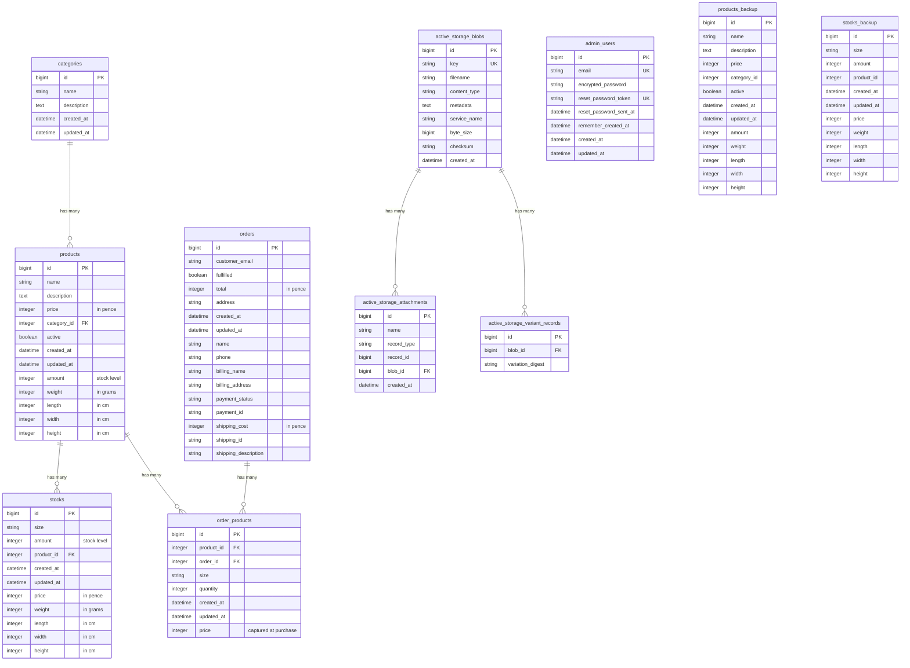

# Database Schema Diagram

## Key Relationships

### Core E-Commerce Flow
- **categories → products**: One category can have many products
- **products → stocks**: One product can have many size variants (stocks)
- **products → order_products**: Products can appear in multiple orders
- **orders → order_products**: One order contains multiple products

### Active Storage (Images)
- **active_storage_blobs → active_storage_attachments**: Polymorphic relationship
  - Products: `has_many_attached :images`
  - Categories: `has_one_attached :image`
- **active_storage_blobs → active_storage_variant_records**: Image variants (thumb, medium)

### Authentication
- **admin_users**: Standalone table (Devise authentication)
  - No foreign key relationships to other tables
  - Only admins have accounts, customers checkout as guests

### Backup Tables
- **products_backup**: Historical snapshot of products table
- **stocks_backup**: Historical snapshot of stocks table
- These are likely from data migration work

## Pricing Model
The schema supports two pricing strategies:

1. **Single Price**: Product has `price` and `amount` directly
2. **Variant Pricing**: Product has multiple Stocks, each with their own `price` and `amount`

## Important Notes
- All prices stored in **pence** (integer)
- All weights in **grams** (integer)
- All dimensions in **cm** (integer)
- `order_products.price` captures the price at time of purchase (not calculated)
- Orders created via Stripe webhook only (no direct user creation)

