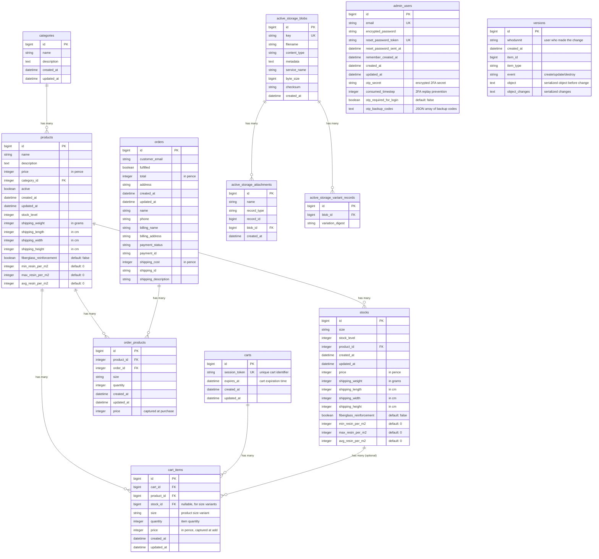

# Database Schema Diagram

Last updated: 2025-11-30
Schema version: 2025_11_30_015033

## Key Relationships

### Core E-Commerce Flow
- **categories → products**: One category can have many products
- **products → stocks**: One product can have many size variants (stocks)
- **products → order_products**: Products can appear in multiple orders
- **orders → order_products**: One order contains multiple products

### Cart & Session Management
- **carts → cart_items**: One cart contains multiple cart items
- **products → cart_items**: Products can be added to multiple carts
- **stocks → cart_items**: Optional relationship for size variants in cart
- **Cart expiry**: Carts automatically expire after 30 days (configurable via `Cart::EXPIRY_DAYS`)
- **Session token**: Unique identifier for each cart, stored in browser localStorage

### Active Storage (Images)
- **active_storage_blobs → active_storage_attachments**: Polymorphic relationship
  - Products: `has_many_attached :images`
  - Categories: `has_one_attached :image`
- **active_storage_blobs → active_storage_variant_records**: Image variants (thumb, medium)

### Authentication & Two-Factor Authentication
- **admin_users**: Standalone table (Devise authentication with 2FA support)
  - No foreign key relationships to other tables
  - Only admins have accounts, customers checkout as guests
  - Uses `devise-two-factor` gem for TOTP-based 2FA
  - Backup codes stored as encrypted JSON array

### Audit Trail (PaperTrail)
- **versions**: Polymorphic audit log tracking changes to all models
  - Tracks who made changes (`whodunnit`)
  - Stores object state before/after changes
  - Indexed for efficient querying

## Pricing Model
The schema supports two pricing strategies:

1. **Single Price**: Product has `price` and `stock_level` directly
2. **Variant Pricing**: Product has multiple Stocks, each with their own `price` and `stock_level`

## Important Notes

- All prices stored in **pence** (integer)
- All weights in **grams** (integer)
- All dimensions (shipping_weight, shipping_length, shipping_width, shipping_height) in **cm** or **grams**
- `order_products.price` captures the price at time of purchase (not calculated)
- Orders created via Stripe webhook only (no direct user creation)
- **fiberglass_reinforcement**: Boolean flag indicating if product/stock is a fiberglass material
- **Resin estimation fields** (min_resin_per_m2, max_resin_per_m2, avg_resin_per_m2): Used for calculating material requirements for composite projects

## Model Relationships & Validations

### Product Model
**Associations:**
- `belongs_to :category`
- `has_many :stocks`
- `has_many :order_products`
- `has_many :cart_items`
- `has_many_attached :images` (with variants: `:thumb`, `:medium`)

**Scopes:**
- `active` - Returns only active products
- `in_price_range(min, max)` - Filters products by price range

**Validations:**
- `name`: required
- `price`: required, integer, >= 0
- `stock_level`: integer, >= 0, nullable
- `shipping_weight`, `shipping_length`, `shipping_width`, `shipping_height`: integer, > 0, nullable

### Stock Model
**Associations:**
- `belongs_to :product`
- `has_many :cart_items`

**Validations:**
- `size`: required
- `price`: required, integer, >= 0
- `stock_level`: integer, >= 0, nullable
- `shipping_weight`, `shipping_length`, `shipping_width`, `shipping_height`: integer, > 0, nullable

### Category Model
**Associations:**
- `has_many :products, dependent: :destroy`
- `has_one_attached :image` (with variant: `:thumb`)

**Validations:**
- `name`: required, unique (case-insensitive)

### Order Model
**Associations:**
- `has_many :order_products`

**Scopes:**
- `unfulfilled` - Returns unfulfilled orders
- `fulfilled` - Returns fulfilled orders
- `recent(limit = 5)` - Returns recent orders (ordered by created_at desc)
- `for_month(date = Time.current)` - Returns orders for a specific month

**Validations:**
- `customer_email`: required, valid email format
- `total`: required, integer, >= 0
- `shipping_cost`: integer, >= 0, nullable
- `address`: required
- `name`: required

### OrderProduct Model
**Associations:**
- `belongs_to :product`
- `belongs_to :order`

**Validations:**
- `quantity`: required, integer, > 0
- `price`: required, integer, >= 0

### Cart Model
**Associations:**
- `has_many :cart_items, dependent: :destroy`

**Scopes:**
- `active` - Returns carts that haven't expired
- `expired` - Returns expired carts

**Validations:**
- `session_token`: required, unique
- `expires_at`: required

**Methods:**
- `find_or_create_by_token(token)` - Class method to find/create cart by session token
- `expired?` - Check if cart has expired
- `extend_expiry!` - Extend cart expiration by 30 days
- `total` - Calculate total price of all cart items
- `refresh_prices!` - Update cart item prices from current product/stock prices
- `merge_items!(other_cart_items)` - Merge items from another cart (for localStorage sync)

### CartItem Model
**Associations:**
- `belongs_to :cart`
- `belongs_to :product`
- `belongs_to :stock, optional: true`

**Validations:**
- `quantity`: required, integer, > 0
- `price`: required, integer, >= 0
- `product_id`: unique within cart and size (prevents duplicate items)

**Methods:**
- `refresh_price!` - Update price from current product/stock price
- `total` - Calculate total for this item (price × quantity)
- `stock_available?` - Check if sufficient stock is available

### AdminUser Model
**Authentication:** Devise modules
- `database_authenticatable`
- `registerable`
- `recoverable`
- `rememberable`
- `validatable`
- `two_factor_authenticatable` (TOTP-based)
- `two_factor_backupable` (backup codes)

**Two-Factor Authentication Methods:**
- `setup_two_factor!` - Generate OTP secret for user
- `enable_two_factor!(otp_attempt)` - Enable 2FA after verifying OTP code
- `disable_two_factor!(password)` - Disable 2FA after password verification
- `two_factor_enabled?` - Check if 2FA is enabled
- `two_factor_pending?` - Check if 2FA setup is in progress
- `regenerate_backup_codes!` - Generate new backup codes
- `validate_backup_code(code)` - Validate and consume a backup code
- `otp_provisioning_uri` - Generate QR code URI for authenticator apps

**Note:** No associations to other models; standalone authentication table

## Indexes

### Products Table
- `index_products_on_active`
- `index_products_on_category_id`
- `index_products_on_name`
- `index_products_on_price`
- `index_products_on_active_and_price_and_category_id` (composite index)

### Stocks Table
- `index_stocks_on_product_id`

### Orders Table
- `index_orders_on_created_at`
- `index_orders_on_fulfilled`
- `index_orders_on_fulfilled_and_created_at` (composite index)

### OrderProducts Table
- `index_order_products_on_product_id`
- `index_order_products_on_order_id`

### Carts Table
- `index_carts_on_session_token` (unique)
- `index_carts_on_expires_at`

### CartItems Table
- `index_cart_items_on_cart_id`
- `index_cart_items_on_product_id`
- `index_cart_items_on_stock_id`
- `index_cart_items_on_cart_id_and_product_id_and_size` (unique composite)

### AdminUsers Table
- `index_admin_users_on_email` (unique)
- `index_admin_users_on_reset_password_token` (unique)

### Versions Table (PaperTrail)
- `index_versions_on_item_type_and_item_id` (composite)
- `index_versions_on_whodunnit`
- `index_versions_on_created_at`
- `index_versions_on_event`

### Active Storage Tables
- `index_active_storage_attachments_on_blob_id`
- `index_active_storage_attachments_uniqueness` (unique composite: record_type, record_id, name, blob_id)
- `index_active_storage_blobs_on_key` (unique)
- `index_active_storage_variant_records_uniqueness` (unique composite: blob_id, variation_digest)

## Schema Version

Current schema version: `2025_11_30_015033` (PostgreSQL 17)

## Foreign Key Constraints

### Cart Tables
- `cart_items.cart_id` → `carts.id` (on_delete: cascade, on_update: cascade)
- `cart_items.product_id` → `products.id` (on_delete: cascade, on_update: cascade)
- `cart_items.stock_id` → `stocks.id` (on_delete: cascade, on_update: cascade)

### Product Tables
- `products.category_id` → `categories.id`
- `stocks.product_id` → `products.id`

### Order Tables
- `order_products.product_id` → `products.id`
- `order_products.order_id` → `orders.id`

### Active Storage Tables
- `active_storage_attachments.blob_id` → `active_storage_blobs.id`
- `active_storage_variant_records.blob_id` → `active_storage_blobs.id`

## Important Data Integrity Notes

### Cascade Deletes
- **Carts**: Deleting a cart automatically deletes all associated cart_items
- **Products**: Deleting a product cascades to cart_items (prevents orphaned cart references)
- **Categories**: Deleting a category cascades to products (as per model `dependent: :destroy`)

### Referential Integrity
- All foreign keys enforce referential integrity at the database level
- Cart items cannot reference non-existent products, stocks, or carts
- Order products maintain references even if product is deleted (no cascade on orders)

