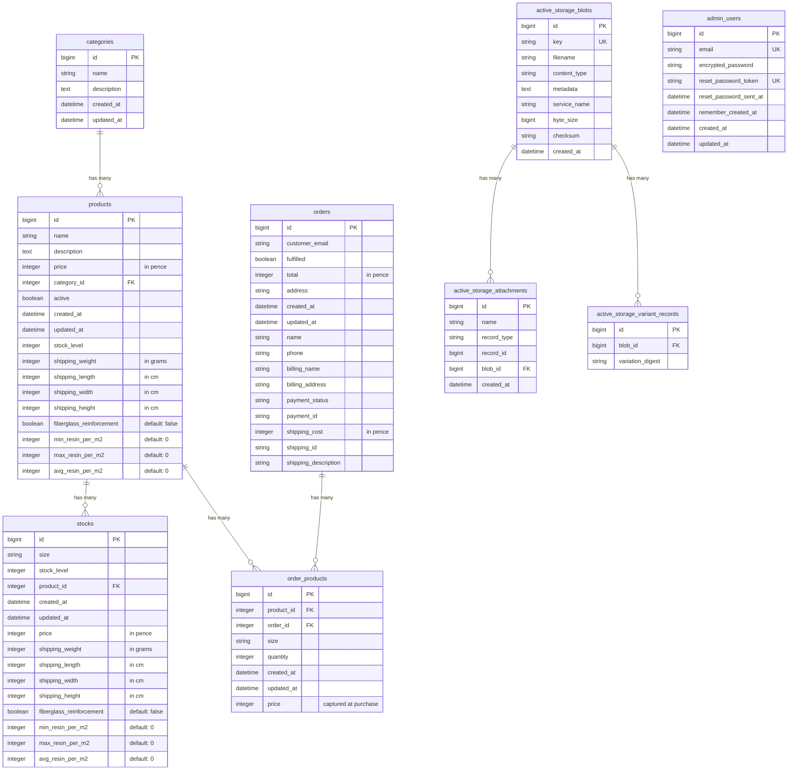

# Database Schema Diagram

## Key Relationships

### Core E-Commerce Flow
- **categories → products**: One category can have many products
- **products → stocks**: One product can have many size variants (stocks)
- **products → order_products**: Products can appear in multiple orders
- **orders → order_products**: One order contains multiple products

### Active Storage (Images)
- **active_storage_blobs → active_storage_attachments**: Polymorphic relationship
  - Products: `has_many_attached :images`
  - Categories: `has_one_attached :image`
- **active_storage_blobs → active_storage_variant_records**: Image variants (thumb, medium)

### Authentication
- **admin_users**: Standalone table (Devise authentication)
  - No foreign key relationships to other tables
  - Only admins have accounts, customers checkout as guests

## Pricing Model
The schema supports two pricing strategies:

1. **Single Price**: Product has `price` and `stock_level` directly
2. **Variant Pricing**: Product has multiple Stocks, each with their own `price` and `stock_level`

## Important Notes

- All prices stored in **pence** (integer)
- All weights in **grams** (integer)
- All dimensions (shipping_weight, shipping_length, shipping_width, shipping_height) in **cm** or **grams**
- `order_products.price` captures the price at time of purchase (not calculated)
- Orders created via Stripe webhook only (no direct user creation)
- **fiberglass_reinforcement**: Boolean flag indicating if product/stock is a fiberglass material
- **Resin estimation fields** (min_resin_per_m2, max_resin_per_m2, avg_resin_per_m2): Used for calculating material requirements for composite projects

## Model Relationships & Validations

### Product Model
**Associations:**
- `belongs_to :category`
- `has_many :stocks`
- `has_many :order_products`
- `has_many_attached :images` (with variants: `:thumb`, `:medium`)

**Scopes:**
- `active` - Returns only active products
- `in_price_range(min, max)` - Filters products by price range

**Validations:**
- `name`: required
- `price`: required, integer, >= 0
- `stock_level`: integer, >= 0, nullable
- `shipping_weight`, `shipping_length`, `shipping_width`, `shipping_height`: integer, > 0, nullable

### Stock Model
**Associations:**
- `belongs_to :product`

**Validations:**
- `size`: required
- `price`: required, integer, >= 0
- `stock_level`: integer, >= 0, nullable
- `shipping_weight`, `shipping_length`, `shipping_width`, `shipping_height`: integer, > 0, nullable

### Category Model
**Associations:**
- `has_many :products, dependent: :destroy`
- `has_one_attached :image` (with variant: `:thumb`)

**Validations:**
- `name`: required, unique (case-insensitive)

### Order Model
**Associations:**
- `has_many :order_products`

**Scopes:**
- `unfulfilled` - Returns unfulfilled orders
- `fulfilled` - Returns fulfilled orders
- `recent(limit = 5)` - Returns recent orders (ordered by created_at desc)
- `for_month(date = Time.current)` - Returns orders for a specific month

**Validations:**
- `customer_email`: required, valid email format
- `total`: required, integer, >= 0
- `shipping_cost`: integer, >= 0, nullable
- `address`: required
- `name`: required

### OrderProduct Model
**Associations:**
- `belongs_to :product`
- `belongs_to :order`

**Validations:**
- `quantity`: required, integer, > 0
- `price`: required, integer, >= 0

### AdminUser Model
**Authentication:** Devise modules
- `database_authenticatable`
- `registerable`
- `recoverable`
- `rememberable`
- `validatable`

**Note:** No associations to other models; standalone authentication table

## Indexes

### Products Table
- `index_products_on_active`
- `index_products_on_category_id`
- `index_products_on_name`
- `index_products_on_price`
- `index_products_on_active_and_price_and_category_id` (composite index)

### Stocks Table
- `index_stocks_on_product_id`

### Orders Table
- `index_orders_on_created_at`
- `index_orders_on_fulfilled`
- `index_orders_on_fulfilled_and_created_at` (composite index)

### OrderProducts Table
- `index_order_products_on_product_id`
- `index_order_products_on_order_id`

### AdminUsers Table
- `index_admin_users_on_email` (unique)
- `index_admin_users_on_reset_password_token` (unique)

### Active Storage Tables
- `index_active_storage_attachments_on_blob_id`
- `index_active_storage_attachments_uniqueness` (unique composite: record_type, record_id, name, blob_id)
- `index_active_storage_blobs_on_key` (unique)
- `index_active_storage_variant_records_uniqueness` (unique composite: blob_id, variation_digest)

## Schema Version

Current schema version: `2025_11_27_015536` (PostgreSQL 17)

